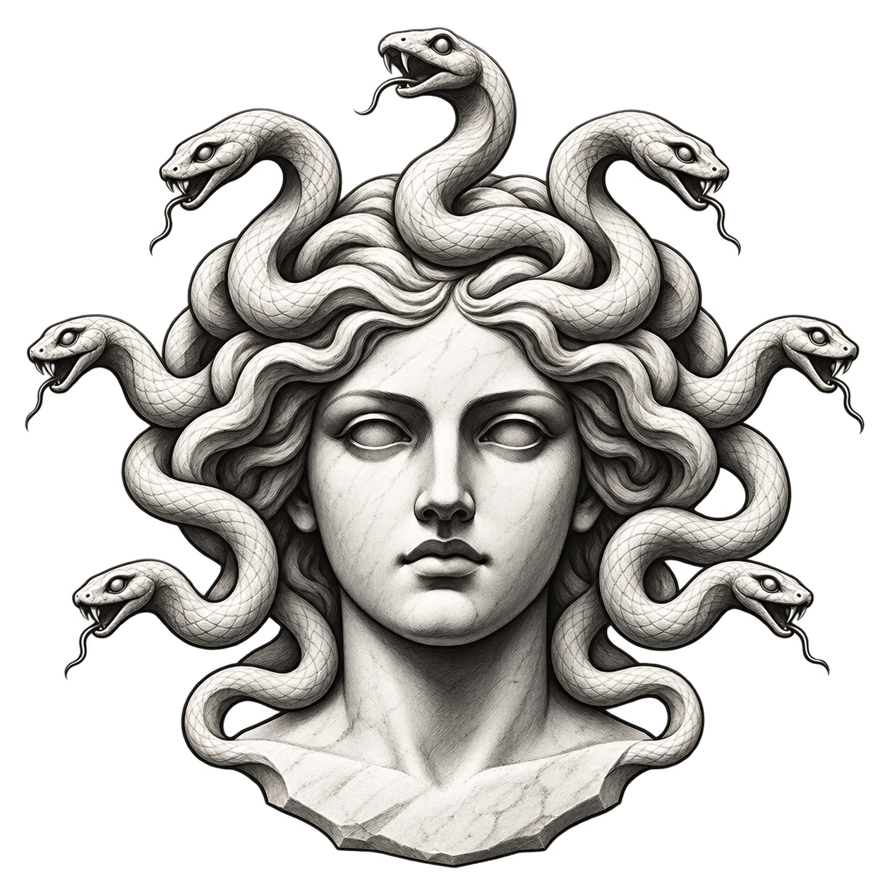
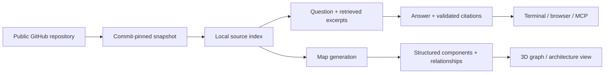

<div align="center">



# Medusae

Follow the threads.

A terminal assistant and visual workspace for exploring unfamiliar GitHub repositories.

[](https://github.com/eye9444/Medusae/actions/workflows/ci.yml) [](https://github.com/eye9444/Medusae/releases)  

[Get started](#get-started) · [Features](#features) · [Models & setup](docs/USAGE.md#models-and-keys) · [MCP](docs/USAGE.md#cli-and-mcp) · [Release notes](https://github.com/eye9444/Medusae/releases)

</div>

## About

Medusae helps you understand unfamiliar code. Give it a public GitHub repository, ask how a feature works, and inspect the files behind the answer. You can explore the same repository as a 3D knowledge graph or an architecture map.

It stores repository snapshots and conversations locally. Each snapshot records a commit, so source references point to the version you analysed. Models run through your chosen provider or Ollama; cloud providers receive the excerpts and conversation context needed for a request.

## Features

The terminal has saved chats, prompt editing and history, model selection, and progress indicators. You can ask about the code or ask for an explanation of an unfamiliar concept. Browser chat keeps earlier answers visible during follow-ups and receives messages from the selected terminal session.

The 3D graph lets you orbit and select nodes. The architecture view groups components by responsibility and shows their relationships. Double-click a node to open its indexed source in a window you can move and resize. Source references in answers open the corresponding files too.

Chat and map generation have separate model settings. Save defaults or use `/model` to change the terminal's model temporarily. Settings also supports masked API key entry, encrypted local storage, and deletion of individual keys or the whole store.

Repository snapshots are reused across chats. Deleting the final chat for a repository removes its stored source and analysis data. Other assistants can access repository research through the `research_repo` MCP tool.

## Get started

Requires Node.js 22.13 or newer and Git. Node.js 24 LTS is recommended. A configured model provider is needed for AI answers and generated maps.

```sh
git clone https://github.com/eye9444/Medusae.git
cd Medusae
npm ci
npm run build
npm start
```

1. Open **Settings → K** to save provider keys, or use environment variables.
2. Choose separate chat and map models with **Settings → C / M**.
3. Select **New Chat** and paste a public repository URL using your terminal's paste shortcut, commonly Ctrl+Shift+V.
4. Ask questions, then use `/map` to open that chat's visual explorer.

Keep Medusae running while using the browser. The explorer runs on a local loopback address with an available port. After updating the app, run `npm ci` and `npm run build`, then restart it.

## How it works



Models return structured answers and map data. Medusae validates source references and renders the graph, cards, and source windows.

## Choose your model

Medusae supports Gemini, OpenRouter, NVIDIA NIM, Ollama, Ollama Cloud, and configurable OpenAI-compatible endpoints.

OpenRouter's free router is supported for chat; Gemini is the initial mapping default. Both are configurable. Local Ollama models are supported too. You use your own provider account. Available models, quotas, prices, and answer quality vary.

[Provider setup and encrypted key storage →](docs/USAGE.md#models-and-keys)

## Built with

Node.js and SQLite handle local services and storage. The browser uses Next.js and React, with React Flow for architecture maps and Three.js/3D Force Graph for the knowledge graph. The MCP server uses the Model Context Protocol SDK.

## Project status

Version 0.1.0 is an early preview. The terminal, browser explorer, provider adapters, and MCP research tool are available. Model requests can fail or time out, and some browser interactions still need manual testing.

- Large repositories are sampled within indexing limits; maps show only part of the codebase.
- General explanations use model knowledge. Repository claims use source references, but citation validation does not guarantee every conclusion is correct.
- Cloud providers receive selected excerpts and relevant conversation context. An Ollama model running on your machine processes those requests locally.
- Run the preview server locally.

[Storage, privacy, and limitations →](docs/USAGE.md#data-and-limitations)

## Development

```sh
npm test
npm run build
```

GitHub Actions runs a clean dependency install, automated tests, and a production build. Live-provider tests are opt-in; browser and terminal interactions also need manual testing.

[Report a bug](https://github.com/eye9444/Medusae/issues) with the repository, selected model, reproduction steps, and a redacted error message.

## License

No license has been selected for this initial release. Public visibility does not grant permission to reuse or redistribute the source beyond rights provided by GitHub's terms. Dependency licenses remain their respective authors' licenses.

<div align="center"><sub>Built by <a href="https://github.com/eye9444">eye9444</a> · Follow the threads.</sub></div>
