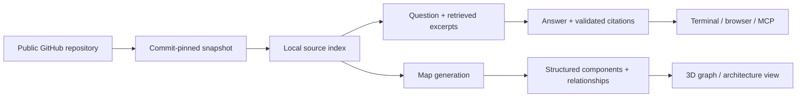

<div align="center">


# M E D U S A E

### Follow the threads. Understand the code beneath.

A terminal assistant and visual workspace for exploring unfamiliar GitHub repositories.

[](https://github.com/eye9444/Medusae/actions/workflows/ci.yml)
[](https://github.com/eye9444/Medusae/releases)


[Get started](#get-started) · [Explore the features](#one-repository-three-ways-in) · [Models & setup](docs/USAGE.md#models-and-keys) · [MCP](docs/USAGE.md#cli-and-mcp) · [Release notes](https://github.com/eye9444/Medusae/releases)

</div>

---

## From “where do I start?” to “here’s how it works.”

Opening an unfamiliar repository often means chasing imports, switching between files, and guessing where a feature lives. Medusae brings those threads together: ask a question in the terminal, explore the project visually, and open the source behind an answer.

Your workspace stays local. Repositories are pinned to a commit, conversations are saved, and the same context follows you between the terminal and browser. Bring your own cloud provider or run a model through Ollama.

## One repository, three ways in

<table>
<tr>
<td width="33%" valign="top">

### 01 · Ask

An animated terminal home, editable prompts, model completion, progress indicators, and persistent conversation history. Ask about implementation—or ask what an unfamiliar concept means.

</td>
<td width="33%" valign="top">

### 02 · Explore

Orbit a colourful 3D knowledge graph or switch to grouped architecture cards. Select a component to inspect its responsibilities and follow its relationships.

</td>
<td width="33%" valign="top">

### 03 · Read

Double-click a node to open its indexed source in a floating window. Move it, resize it, and keep exploring the graph alongside the code.

</td>
</tr>
</table>

### Small details that make exploration easier

| Feature | What it gives you |
| --- | --- |
| **Connected conversations** | Follow-ups retain previous answers; browser chat can minimize or expand and picks up messages from the selected TUI session. |
| **Separate model choices** | Use one model for Q&A and another for map generation. Save defaults, or switch temporarily with `/model`. |
| **Source references** | Repository claims link to validated excerpts from the pinned snapshot. Inferred map relationships remain distinct. |
| **Local key management** | Masked entry, encrypted storage, visible file locations, and individual or complete deletion from Settings. |
| **Reusable repository snapshots** | Multiple chats can share indexed repository data. Deleting the last chat cleans up its repository data. |
| **MCP access** | Other assistants can call `research_repo` for a compact answer with commit-pinned citations. |

## Get started

Requires **Node.js 22.13 or newer** and **Git**. Node.js 24 LTS is recommended. A configured model provider is needed for AI answers and generated maps.

```sh
git clone https://github.com/eye9444/Medusae.git
cd Medusae
npm ci
npm run build
npm start
```

1. Open **Settings → K** to save provider keys, or use environment variables.
2. Choose separate chat and map models with **Settings → C / M**.
3. Select **New Chat** and paste a public repository URL using your terminal's paste shortcut, commonly Ctrl+Shift+V.
4. Ask questions, then use `/map` to open that chat's visual explorer.

Keep Medusae running while using the browser. The explorer runs on a local loopback address with an available port. After updating the app, run `npm ci` and `npm run build`, then restart it.


## How it works



**Models explain the source; Medusae renders the interface.** The model returns structured data rather than executable HTML. The renderer owns the graph layout, colours, interactions, and source windows.

## Choose your model

**Gemini · OpenRouter · NVIDIA NIM · Ollama · Ollama Cloud · compatible endpoints**

OpenRouter's free router is supported for chat; Gemini is the initial mapping default. Both are configurable. Local Ollama models are supported too. Provider availability, quotas, pricing, and answer quality vary—Medusae does not supply inference credits.

[Provider setup and encrypted key storage →](docs/USAGE.md#models-and-keys)

## Built with

| Layer | Technology |
| --- | --- |
| Terminal & local services | Node.js, SQLite |
| Browser workspace | Next.js, React |
| Architecture canvas | React Flow |
| 3D knowledge graph | Three.js, 3D Force Graph |
| Assistant integration | Model Context Protocol SDK |

## Project status

**v0.1.0 · Early preview.** The core terminal, browser explorer, provider adapters, and MCP research tool are available. This is an evolving personal project, with room for better indexing, model reliability, and interaction polish.

- Large repositories are sampled within indexing limits; a map is not a complete runtime call graph.
- General explanations use model knowledge. Repository claims use source references, but citation validation does not guarantee every conclusion is correct.
- Cloud providers receive selected excerpts and relevant conversation context. A genuinely local Ollama model keeps inference local.
- The preview server is intended for your machine, not public hosting.

[Storage, privacy, and limitations →](docs/USAGE.md#data-and-limitations)

## Development

```sh
npm test
npm run build
```

GitHub Actions runs a clean dependency install, automated tests, and a production build. Live-provider tests are opt-in; browser and terminal interactions also need manual testing.

Found a rough edge? [Open an issue](https://github.com/eye9444/Medusae/issues) with the repository, selected model, reproduction steps, and a redacted error message.

## License

No license has been selected for this initial release. Public visibility does not grant permission to reuse or redistribute the source beyond rights provided by GitHub's terms. Dependency licenses remain their respective authors' licenses.

---

<div align="center"><sub>Built by <a href="https://github.com/eye9444">eye9444</a> · Follow the threads.</sub></div>
